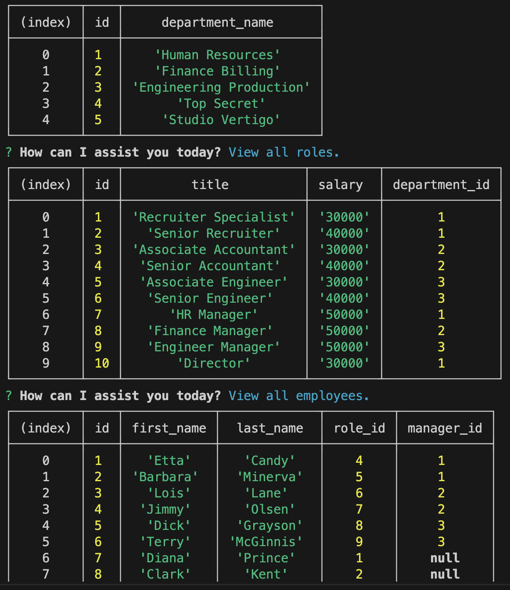

# BC12-Employee-Tracker

## Description:
* Content Management Systems (CMS). Employee Tracker.
* A command-line application to manage a company's employee database.
* This application uses Inquirer and MySQL2.
* [Video Walkthrough: Employee Tracker.](https://youtu.be/Z6OYVvLMlmw)

## Installation:
* `git clone git@github.com:Junel-Balbin/BC12-Employee-Tracker.git`
* `npm install`
* `mysql -u root -p`
* `source copy path, schema.sql & seeds.sql`
* `node index.js`

## Usage:
* [Video Walkthrough: Employee Tracker.](https://youtu.be/Z6OYVvLMlmw)

## Application User Interface:

## Credits & Resources:
* Google search & Youtube videos.
* Mini Project 12: EdX and UCB.
* ChatGpt for troubleshooting.
* Stack Overflow & MDN.

## Coded With:
* Inquirer.
* MySQL2.
* Node.js.
* VS Code.
* Youtube.

## Contributing:
* Any ideas or feedback is very much appreciated.

## License:
